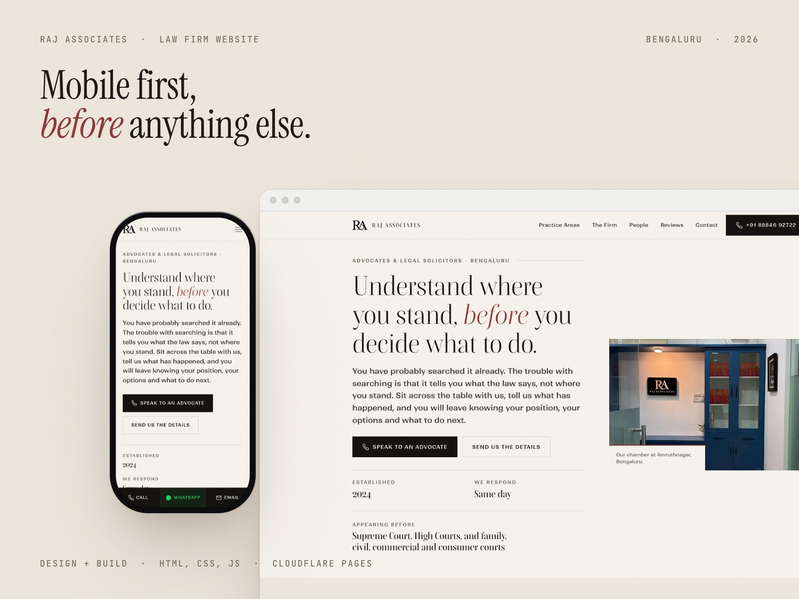
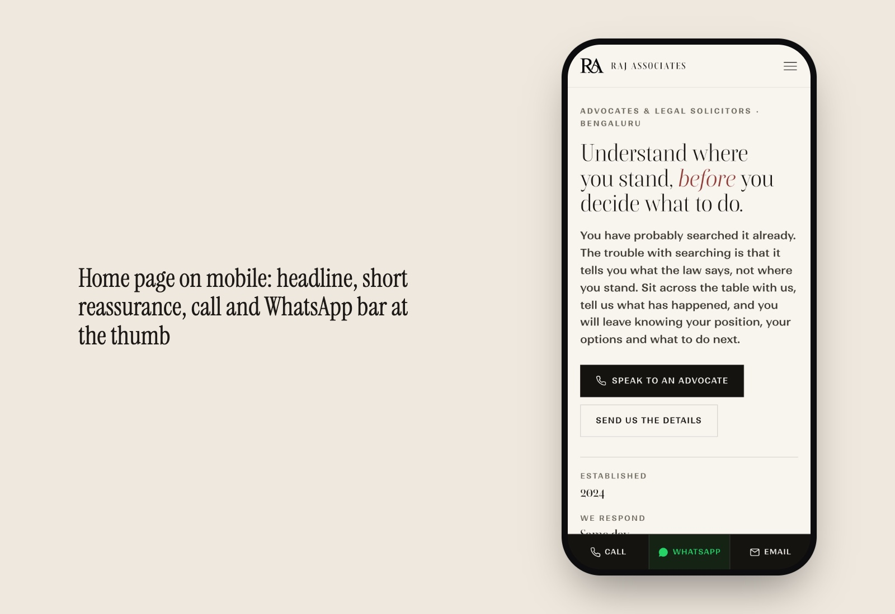
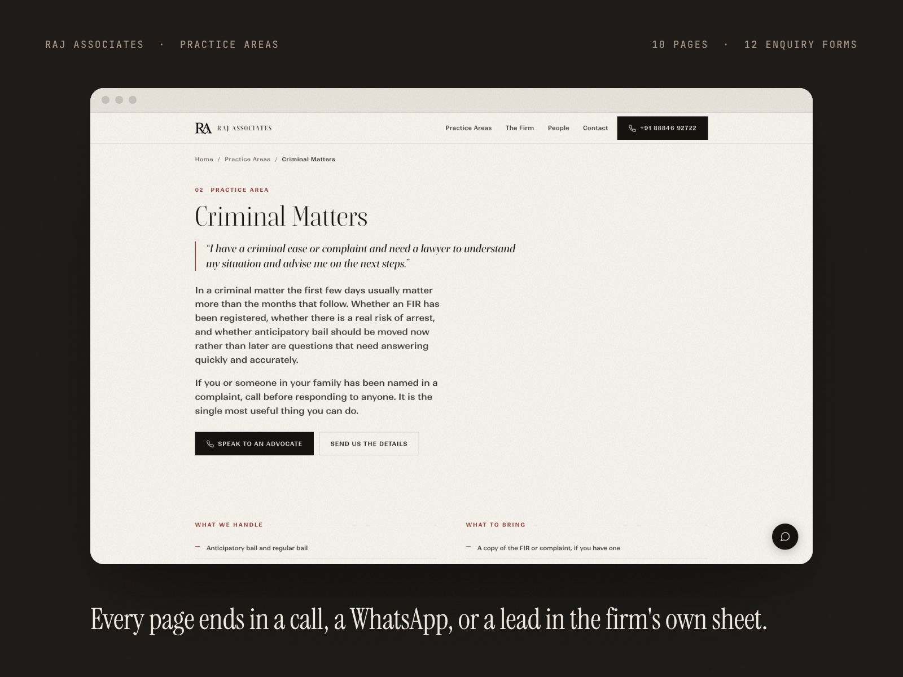
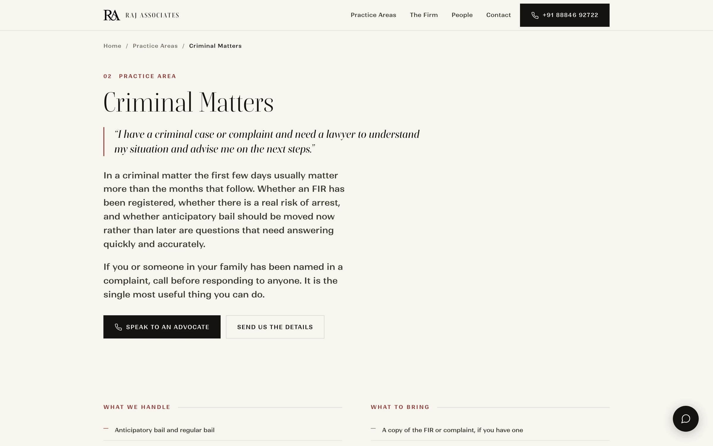

# Raj Associates

**A website for a litigation practice in Bengaluru, designed for one frightened person on a mid-range phone, inside a professional conduct rule that forbids nearly every claim a law firm site usually makes. Design and build, freelance, September 2026.**

Live at [rajassociateslaw.in](https://rajassociateslaw.in)

## The brief, and the problem inside it

The firm sent seven reference sites they liked. They fell into two groups that do not agree with each other.

**Group A, prestige.** Serif type, heavy whitespace, a muted palette. No pop-ups, no testimonials, no urgency. These sites sell institutional standing to general counsel and referring firms, and assume the work already arrives by reputation.

**Group B, lead generation.** Sticky call and WhatsApp bars, a callback form above the fold, review walls, "Trusted by 5000+ clients", "24/7 support". Built to catch someone searching "divorce lawyer Bangalore" at eleven at night.

Admiring both meant the firm had not yet decided what the website was for. So that became the first design decision.

## Direction: Group B mechanics, Group A manners

Conversion-first structure, delivered with restraint. The plumbing comes from Group B and the tone from Group A.

**Kept from Group B**
- A three-field callback form: name, phone, matter type
- Reassurance microcopy right beside the form
- One page per practice area, carrying both search and conversion
- The phone number in the header of every page, and one-tap call and WhatsApp throughout

**Deliberately left out**
- Superlatives and client counts
- Testimonial walls
- Pop-ups
- Manufactured urgency

## The rule that shaped the copy

Bar Council of India Rule 36 restricts advertising and solicitation by advocates. A website may carry factual particulars: names, contact details, qualifications and areas of practice. "Best law firm in Bangalore" and review walls sit squarely in the exposed zone.

I raised this in the proposal, before any copy was written, and set it out as three options with a recommendation, because the risk is the firm's and the choice had to be theirs, made knowingly.

The useful part: it cost nothing. Every conversion mechanic is compliant. Fast mobile pages, tap-to-call, a short form, clear practice pages and honest descriptions of what the firm handles. Only the puffery goes. A frightened reader trusts specificity more than bragging anyway.

## Who is actually on the page

Not a procurement committee. One frightened person, on a mid-range Android phone, on patchy 4G. Served a notice. Facing a cheque bounce case. Halfway through a divorce.

They are anxious, often ashamed, in a hurry, and quietly worried about two things they will never type into a search box:

> What is this going to cost me?
> Will this person judge me?

Every decision on the site follows from those two questions. The hero line says it plainly: *Understand where you stand, before you decide what to do.*

Home page on mobile: headline, short reassurance, call and WhatsApp bar at the thumb

## Colour, and what it does

| Role | Colour | Why |
|---|---|---|
| Dominant | Deep navy | Trust and stability, the lowest-risk anchor in legal design |
| Accent | Burgundy | Gravitas with a warmer, human edge, so it reads as an advocate, not a corporation |
| Detail | Muted brass, sparingly | Hairlines and small marks only, never fills, so it never turns ceremonial |
| Ground | Warm bone, not white | Reads like paper and legal stationery, calmer for a distressed reader |
| Absent | No red | No urgency banners or countdowns. This visitor is already frightened |
| Quarantined | WhatsApp green | Confined to the WhatsApp glyph, never a brand colour |

## What was built

- A home page covering the practice, the people and how a first consultation works
- **Ten practice area pages**: criminal, cybercrime, cheque bounce, money recovery, family and matrimonial, civil and property, property verification, consumer, banking and finance, and High Court matters. Each ends in a call, a WhatsApp or an enquiry
- An internship page, a disclaimer page and a thank-you page
- **Twelve enquiry forms** that post through Google Apps Script straight into the firm's own Google Sheet, so leads never sit in a third-party inbox

Practice area page: plain-language intro, what the firm handles, what to bring

Criminal matters practice page on desktop

## Getting the details right on a phone

A full mobile audit before launch found and fixed real problems:

- **The primary button** is full width and 52px tall, above the 44px thumb target
- **Practice pages went blank** after a visitor accepted the disclaimer, because the script hid the page along with the overlay. Fixed
- **The home page headline was clipping** on small screens. Fixed
- **Sixteen dead links** that did nothing when tapped now point to the right sections
- **Tap targets** in the footer and header that were 17 to 24px tall were enlarged
- **Phone numbers were being corrupted** in the Sheet, because Sheets reads a value starting with "+" as a formula. Fixed in the script

## Stack

Figma for design. Hand-built HTML, CSS and JavaScript for speed on weak connections. Google Apps Script and Google Sheets for leads. Hosted on Cloudflare Pages.

## Outcome

Live, handed over and paid in full. The firm owns its leads in its own Sheet, the site works on the phones its clients actually carry, and none of its copy relies on the claims the Bar Council restricts.

---

Designed and built by **Anurag Adhikari** · Anurag Studio · [anurag.studio](https://anurag.studio) · hello@anurag.studio
